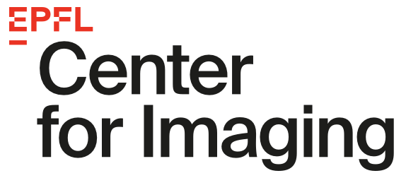

<span style="float:right; font-size:0.8em; text-align:center"><br>24 September 2025</span>



#   Introduction to ImageJ/Fiji for Image Analysis and Macros Scripting

*[Daniel Sage](mailto:daniel.sage@epfl.ch?subject=Single%20Molecule%20Tracking%20and%20Diffusion) — Biomedical Imaging Group and Center for Imaging, Ecole Polytechnique Fédérale de Lausanne, Switerzland*


## Practice A

This hands-on module guides you to the quantitative single-particle diffusion analysis. Across four practices, you will:

- **Analyze SMLM data in Fiji**
- **Track particles** 
- **Understand diffusion Model in Python**
- **Integrate a SPT pipeline** 

By the end, you’ll understand the full SMLM/SPT pipeline—localization, tracking, diffusion modeling, and quantitative readouts through simple examples.


### Setting up Fiji
> **Prerequisite:** A laptop with installation permissions.


### Setting up the Jupyter environment


> **Prerequisite:** A Google account (preferably private).

1. Open [Google Colab](https://colab.research.google.com)  
2. Upload the notebooks from this GitHub repository.  
3. Go to **File > Save a copy in Drive** to keep your own editable version.  


> **Prerequisite:** A working Conda installation.

```
conda create --name spt-diffusion python=3.11
conda activate spt-diffusion

pip install notebook
pip install scikit-image scikit-learn
pip install andi-datasets deeptrack trackpy

jupyter notebook
```

<br>


## Practice B - Particle Tracking

> **On Fiji**
- Tracking of molecules — TrackMate

<br>
<hr>
 
###  Practice C - Modeling Molecular Diffusion

> **Python Notebook**

#### `simulation_brownian_motion.ipynb`
- Isotropic Brownian Motion
- Anisotropic Brownian Motion
- Non-homogeneous Brownian Motion

#### `simulation_anomalous_diffusion.ipynb`
- Test the 5 models provided by the ANDI Challenge
- Reference: https://github.com/AnDiChallenge/andi_datasets

###  Practice D - Estimation of Molecular Diffusion

#### `classification_trajectory.ipynb`
- Compute simple features of trajectory
- Classify the trajectory using a Random Forest classifier


#### `simple_single_particle_tracking.ipynb`
- Simulation 2 groups of blinking particles (slow and fast diffusion) and generating corresponding noisy frames
- Detection and tracking of particles 
- Recover diffusion coefficient of the detected particles


>**Exercise** 
>- Accurate localization of particles and track them
>- Recover diffusion coefficient of the localized particles
> 